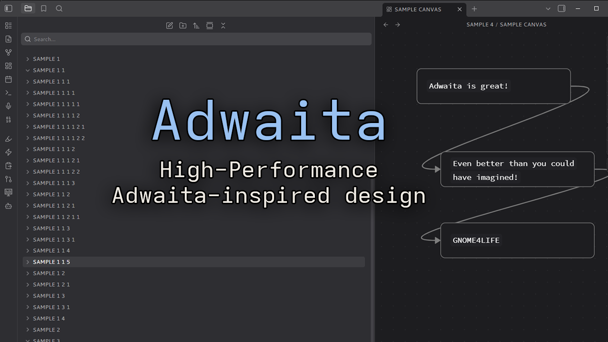

# Adwaita Modern

A simple [libadwaita](https://gnome.pages.gitlab.gnome.org/libadwaita/)-inspired theme for Obsidian, bringing the GNOME look to your vault.

## About

Adwaita Modern recolors Obsidian using the libadwaita 1.6+ default palette. It only overrides Obsidian's own CSS variables, with no custom styling or settings, so it stays fast, lightweight, and should keep working as Obsidian updates.

Inspired by [Adwaita for Steam](https://github.com/tkashkin/Adwaita-for-Steam) by tkashkin.

## Features

- Light and dark modes using the libadwaita view, window, sidebar and dialog colors
- Adwaita blue accent by default, and it respects Obsidian's accent color picker (Settings → Appearance → Accent color), like GNOME's accent setting
- GNOME palette for red, orange, yellow, green, cyan, blue, purple and pink, so callouts and colored text match
- Adwaita-style filled text inputs in dark mode
- Adwaita-style rounded corners on buttons, inputs and dialogs

## Fonts

The theme uses [Adwaita Sans and Adwaita Mono](https://gitlab.gnome.org/GNOME/adwaita-fonts), the GNOME 48+ defaults. They aren't bundled. If they aren't installed, it falls back to Cantarell, Inter, or your system font.

## Credits

- Colors from the [libadwaita](https://gitlab.gnome.org/GNOME/libadwaita) default stylesheet and the [GNOME HIG palette](https://developer.gnome.org/hig/reference/palette.html)
- Inspired by [Adwaita for Steam](https://github.com/tkashkin/Adwaita-for-Steam)

This project isn't affiliated with GNOME. 

## License

MIT
